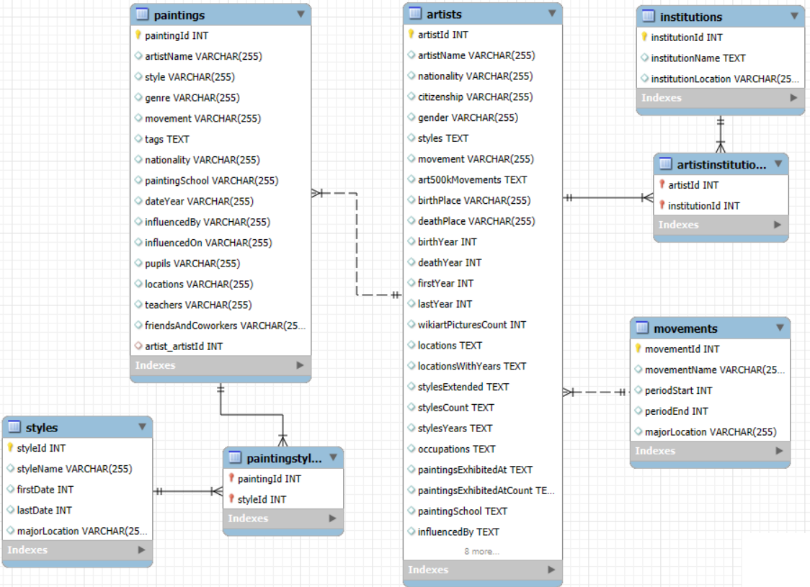

# Painters-Paintings-Institutions-SQL-database
For the Data Engineering 1 course at CEU. Project 1: relational databases in SQL.

## A data warehouse for analyzing paintings and painters

With information (data) about painters and their paintings, institutions and movements, and the styles of paintings, I can ask various questions regarding the relations of these entities:

-- What styles are most common per institution?
-- Most common movements per style and most common styles per movement (excluding cases when style and movement are the same)?
-- Which painters have the most paintings preserved (assuming most paintings of famous painters are stored in the database)?

In order to answer such questions, we need to create and for future purposes maintain a relational database, querying relational information (i.e. information based on the connections between styles-paintings-painters-movements-institutions). This project continues my work of creating such databases and tools, but is the only one designed with a relational structure and designed to be maintainably updated (and queried). 

## Technical details

The collected datasets are stored in the following CSV files: `artists.csv` for painters, `paintings_art500k.csv` and `paintings_wikiart.csv` for paintings.<br>
From these, I derived also tables for institutions, movements (one per artist) and styles (of paintings, a painting can have multiple styles even).<br>
To add extra information to the institution, movement and style tables, I added location information from the file `institutions_origins.csv`, `movements_origins.csv` and `styles_origins.csv` files. (These include an instance for each institution/movement/style, and the origin location of it, "predicted" by Generative AI (using Python) to have broader information.)

**To run the project, after cloning, in the `operational_layer_data_processing.sql` file change the paths for each imported CSV file!** Unfortunately MySQL doesn't support variables in the `LOAD DATA INFILE` command, nor does it support `LOAD DATA` inside stored procedures, and relative paths are relative to the .exe not the script, so the paths were "hardcoded".

The files should be ran in the following order: **`operational_layer_data_processing.sql`**, **`analytics_table.sql`**, **`pipeline.sql`**, **`data_marts.sql`**.

## The structure of the created database

After importing a table of painters, importing 2 painting datasets and combining them into one table, and deriving tables for institutions, movements and styles from the data of painters and paintings, enriched with external information (of locations), the database took up the following structure:



Every painter has one movement (which can have multiple painters), and every painting has one painter (who can have multiple paintings).<br>
However, painting-style and painting-institution relations are many-to-many; to deal with this an inbetween table is creating for each of these relations.<br>
The datasets which are used to create the painting table and other tables are not included in the diagram, as they can be dropped after these tables are loaded with data.

## Analytical plan

...

## Separate files/layers

The separate files/layers are as follows, and should be ran in the following order:

**`operational_layer_data_processing.sql`**: An operational data layer in SQL, designed for MySQL local instances: Importing data of painters and paintings, and creating relations. Firstly, data of painters are loaded into the created table of artists, then the institutions, artist-institutions, movements and styles tables are created with the right constraints. I then create temporary tables for the two datasets of paintings (Art500k and WikiArt). Only then I create the combined table of paintings, with constraints and foreign keys to save time (the paintings table is massive), and I fill it up with the two datasets' instances, dropping the temporary tables afterwards.<br>
As last steps, I fill up columns with the right values: firstly I add instances of movements and styles based on the movements from the painters table and styles from the paintings table. These are stored in the style and movement column, I do not need to take multiple columns for the information, however styles for one instance are separated by commas (e.g. *Expressionism, Pointillism*), therefore I select each value separated by a comma - this can be effectively done by this query:

```SQL
SELECT DISTINCT TRIM(SUBSTRING_INDEX(SUBSTRING_INDEX(style, ',', numbers.n), ',', -1)) AS substring
FROM Paintings
JOIN (SELECT 1 n UNION ALL SELECT 2 UNION ALL SELECT 3) numbers -- Just numbers 1, 2, 3
ON CHAR_LENGTH(style) - CHAR_LENGTH(REPLACE(style, ',', '')) >= numbers.n - 1
```

For each comma (numbered from 1 to 3), the first `substring_index` function cuts out any text after the comma, and the second `substring_index` function cuts out anything up to the previous comma (trim removes redundant spaces). There is no instance with more than 3 styles, so joining with (1,2,3) is enough, this join will include all comma separated styles. I do similarly with the institutions, and for the two inbetween tables of painting-style and painting-institution relations I use the `FIND_IN_SET` function to find pairs of IDs.<br>
Once I have these, I update artist and painting foreign keys, and start filling up the remaining columns of styles, movements and institutions. The first two include a firstDate and lastDate column / periodStart and periodEnd column, which I fill up the earliest date of the style/movement, looking for 4-digit numbers in the painting dates. The location information is then filled from `institutions_origins.csv`, `movements_origins.csv` and `styles_origins.csv` files, with the help of temporary tables.

This results in the diagram seen above.

**`analytics_table.sql`**: The "analytical layer", contains the construction of a denormalized table building on the relational database created prior. ...

...